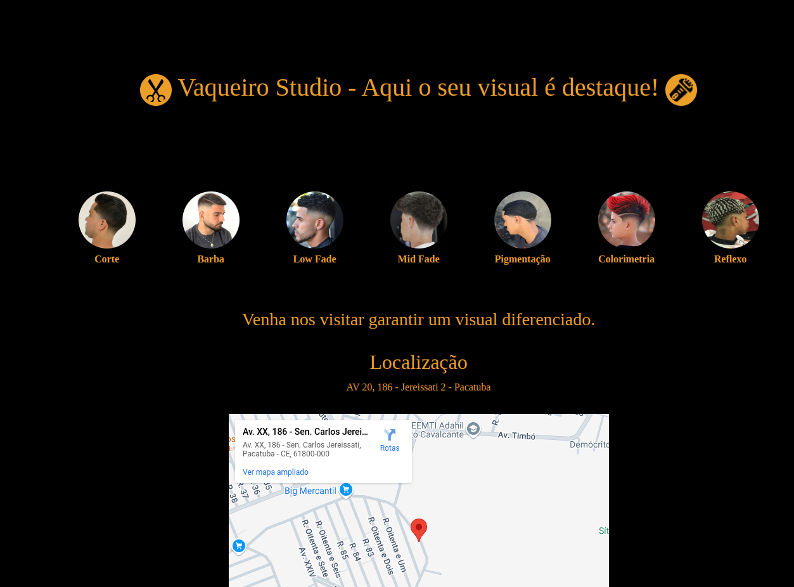

<h1>Vaqueiro Studio</h1>

Pagina de apresentação do Vaqueiro Studio. Criado usando HTML e CSS, trazendo um pouco do trabalho que é realizado pela equipe contendo um mapa de localização para quem quiser "dar um upgrade no visual"  obs: na versão mobile não contem o mapa. Você pode visualizar o resultado : <a href="https://marciojesusmaia.github.io/vaqueiro-studio/">aqui</a>

